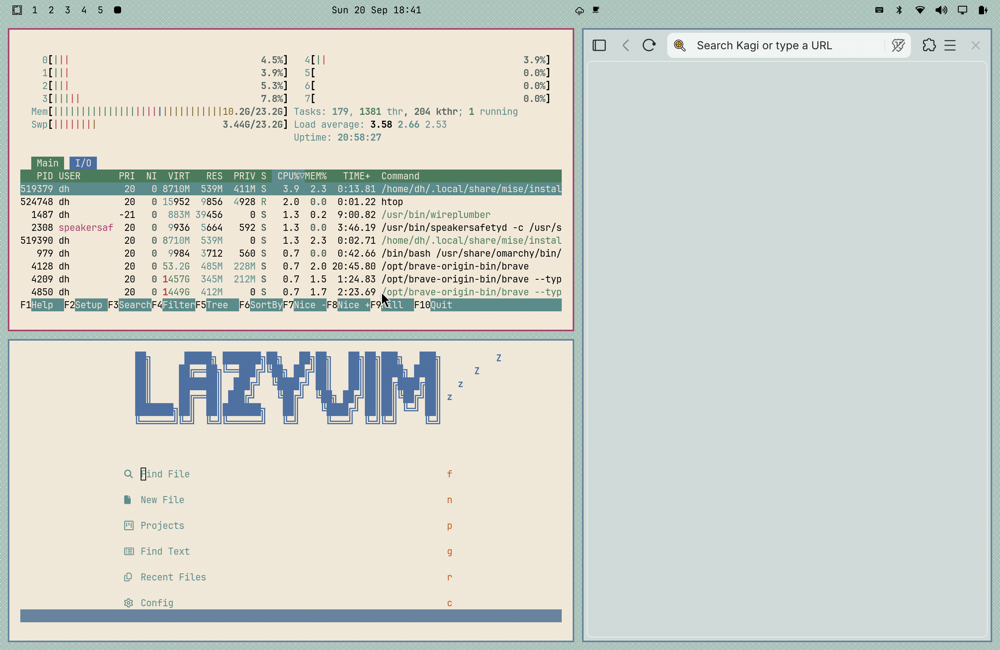

# Solstice — Crimson

An Omarchy theme built on the **original Solaris CDE "Crimson4" palette**
(`Crimson4.dp`): deep crimson selection, sage-green chrome, warm sand canvas,
and steel blue for troughs, recessed surfaces, and inactive borders.

Every core color is byte-exact from the 48-bit original palette — a genuinely
distinct member of the CDE Crimson family, unlike the near-twin `Crimson.dp`.
See [Solstice Daylight](https://github.com/circumspace/omarchy-solstice-daylight-theme)
(Solyaris skeleton) and
[Solstice Nightwatch](https://github.com/circumspace/omarchy-solstice-nightwatch-theme)
(dark companion) for the other palettes in the family.

## Preview



## Install

```bash
omarchy theme install https://github.com/circumspace/omarchy-solstice-crimson-theme
```

Then select **Solstice Crimson** from the Omarchy theme picker.

Or manually:

```bash
git clone https://github.com/circumspace/omarchy-solstice-crimson-theme \
  ~/.config/omarchy/themes/solstice-crimson
```

## Palette

| Role | Hex | Source |
|------|-----|--------|
| Rose (selection, active) | `#A93F6C` | `Crimson4.dp` slot 1, exact |
| Chrome (panels, bars) | `#9CB9AF` | `Crimson4.dp` slot 2, exact |
| Steel (troughs, recessed) | `#65819C` | `Crimson4.dp` slot 3, exact |
| Canvas (terminal, docs) | `#F2E9D9` | `Crimson4.dp` slot 4, exact |
| Ink (foreground) | `#000000` | ink on chrome |

Full provenance in [`palette.txt`](palette.txt).

## What's themed

- **Hyprland** — crimson active border (`#A93F6C`), steel inactive border.
- **GTK 3 / GTK 4** — chrome + crimson selection overrides; sharp CDE corners
  (`border-radius: 0`). GTK loads user CSS once at startup, so **restart** GTK
  apps after switching *into or out of* this theme for colors to take.
- **Terminal** — Ghostty / Alacritty / Kitty / foot palettes generated from
  `colors.toml`; terminals sit on the sand canvas with WCAG-checked accents.
- **Browser chrome** — `chromium.theme` tints Brave/Chromium/Edge frame color
  (light tones are handled via Chromium's MD3 palette; expect subtle results).
- **Neovim** — self-contained `neovim.lua` colorscheme (no plugin dependency).
- **btop, Zed/VS Code, Helix** — generated from `colors.toml`.

## Wallpapers

Fourteen procedurally-generated backdrops in `backgrounds/` (6K, downscale
cleanly), rendered from [NsCDE](https://github.com/NsCDE/NsCDE) XPM tile
patterns with the Motif colorset derived from this palette's chrome
(`bg #9CB9AF`, `ts #D5E1DD`, `bs #53635E`, `sel #859D95`): **Solyaris, Dimple,
Dune, Swirl, Squares, Marble, Toronto, SandLight, CircuitBoards, Lattice,
Concave, Convex, PinStripe, Bark**. Regenerate with
[circumspace/scripts `gen-cde-wallpapers`](https://github.com/circumspace/scripts).

## License

MIT — see [LICENSE](LICENSE).
